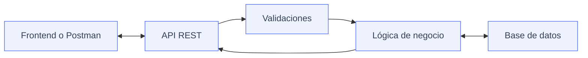

UserManager API es una API REST para gestionar usuarios de una aplicación.
Permitirá registrar usuarios, iniciar sesión, consultar perfiles, modificar datos, gestionar roles y proteger rutas privadas mediante autenticación.

| Recurso | Explicación |
| :---: | :--- |
| 🔐 **`/auth`** | Servirá para registrar usuarios e iniciar sesión. |
| 👥 **`/users`** | Servirá para consultar, crear, modificar y eliminar usuarios. |
| 💚 **`/health`** | Servirá para comprobar que la API está funcionando. |

### 👤 Campos del usuario

| Campo | Explicación |
| :---: | :--- |
| 🆔 **`id`** | Identificador único del usuario. |
| 🧑 **`name`** | Nombre completo del usuario. |
| ✉️ **`email`** | Correo electrónico del usuario. |
| 🔒 **`passwordHash`** | Contraseña cifrada. |
| 🛡️ **`role`** | Rol del usuario: `USER` o `ADMIN`. |
| ✅ **`isActive`** | Indica si el usuario está activo o desactivado. |
| 📅 **`createdAt`** | Fecha de creación. |
| 📝 **`updatedAt`** | Fecha de última modificación. |

### Endpoints de la API

| Método | Ruta | Descripción | Acceso |
| :---: | :--- | :--- | :--- |
| `GET` | `/api/health` | Comprueba si la API funciona. | Público |
| `POST` | `/api/auth/register` | Registra un usuario. | Público |
| `POST` | `/api/auth/login` | Inicia sesión. | Público |
| `GET` | `/api/users/me` | Consulta mi perfil. | Usuario autenticado |
| `GET` | `/api/users` | Lista todos los usuarios. | `ADMIN` |
| `GET` | `/api/users/:id` | Consulta un usuario por ID. | `ADMIN` o propio usuario |
| `PATCH` | `/api/users/:id` | Modifica un usuario. | `ADMIN` o propio usuario |
| `DELETE` | `/api/users/:id` | Elimina o desactiva un usuario. | `ADMIN` |
| `PATCH` | `/api/users/me/password` | Cambia mi contraseña. | Usuario autenticado |
| `PATCH` | `/api/users/:id/role` | Cambia el rol de un usuario. | `ADMIN` |
| `PATCH` | `/api/users/:id/status` | Activa o desactiva un usuario. | `ADMIN` |


### Flujo de la API


El cliente envía una petición a la API. La API valida los datos, aplica la
lógica necesaria, consulta o modifica la base de datos y devuelve una respuesta.

### Reglas

- El email no se puede repetir.
- La contraseña no se guarda en texto plano.
- La API nunca devuelve `passwordHash`.
- Un `USER` solo puede acceder a su propia información.
- Un `ADMIN` puede gestionar usuarios.
- Un usuario inactivo no puede iniciar sesión.
- La contraseña debe tener al menos 8 caracteres alfanuméricos.
- El nombre de usuario no puede estar vacío.

### Errores

- El correo electrónico ya se encuentra registrado -> 409 Conflict
- La contraseña es inválida -> 401 Unauthorized

### Respuesta JSON del perfil

Para consultar el perfil del usuario autenticado mediante `GET /api/users/me`, la API responderá con el estado `200 OK` y los datos del usuario, sin incluir la contraseña cifrada:

```json
{
	"id": "usr_123456",
	"name": "María García",
	"email": "maria.garcia@example.com",
	"role": "USER",
	"isActive": true,
	"createdAt": "2026-09-04T10:30:00Z",
	"updatedAt": "2026-09-04T10:30:00Z"
}
```
### ¿Qué es una API y para qué sirve?

Es una interfaz que trabaja de intermediaria para poder conectar, a través de diversas reglas y protocolos, diferentes aplicaciones y que compartan datos y funciones entre sí. Permite ahorrar tiempo, optimizar procesos y conectar aplicaciones sin tener que comenzar todo desde cero.